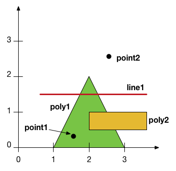

% Geospatial Processing <br> with Python
% <small>Jacob Wasserman / <a href="https://twitter.com/jwass200">@jwass2000</a></small>
% <small><a href="https://twitter.com/MaptimeBoston">Maptime Boston</a> &mdash; 2016-06-15</small>


<section>
<h3>Follow along:</h3>
<h3>[https://jwass.github.io/maptime-boston-python/slides](https://jwass.github.io/maptime-boston-python/slides)</h3>
</section>


Overview
=======

- Why Python?
- Core Geospatial Libraries
- Geospatial Python Libraries
- Examples and Exercises


Why Python?
===========

Scientific Computing
====================

 - [numpy](http://numpy.org): vectorized array/matrix data structures 
 - [scipy](http://scipy.org): linear algebra, optimization, and much more
 - [pandas](http://pandas.pydata.org/): data analysis, extraction, cleaning
 - [scikit-image](http://scikit-image.org/): image processing
 - [scikit-learn](http://scikit-learn.org/stable/): machine learning


Web Frameworks
==============
 - [Django](https://djangoproject.com): "batteries included" framework
 - [Flask](http://flask.pocoo.org/): "microframework" with large community of
   extensions and functionality

 Many companies are built with Python as primary backend language


[REPL](https://en.wikipedia.org/wiki/Read%E2%80%93eval%E2%80%93print_loop) environments
=============================

 - [Read Eval Print Loop](https://en.wikipedia.org/wiki/Read%E2%80%93eval%E2%80%93print_loop)
 - [ipython](https://ipython.org/): interactive computing environment
 - [Jupyter Notebook](http://jupyter.org/): web-based with inline results and
   presentation

Glue Language
=============

 - ["Using Python as a Glue Language"](http://docs.scipy.org/doc/numpy-1.10.1/user/c-info.python-as-glue.html)
 - Python bindings  "wrap" C/C++ libraries
 - Enables idiomatic Python constructs with C/C++ speed and memory control
   when necessary
 - Don't have to re-code a library in Python to use
   it from Python.
 - [cython](http://cython.org/): a Python-like language that compiles C
   extensions

Much More!
==========

Core Geospatial Libraries
=======


Common Spatial Needs
=====================
  - Spatial predicates, operations, computational geometry (shape intersections, point in polygon, [DE-9IM](https://en.wikipedia.org/wiki/DE-9IM) )
  - File I/O (vector / raster) for many formats
  - Raster image manipulation
  - Projections and transformations 
  - Spatial indexing 


[GEOS](https://trac.osgeo.org/geos/)
======

  - Geometry Engine Open Source
  - Defines Point, LineString, Polygon, Multi\* types
  - Spatial predicates (intersects, contains, touches, etc) and other
    operations between any combination of geometries
  - Most PostGIS geometry type (but not geography) operations use GEOS under
    the hood

[GDAL](http://www.gdal.org/)
======

 - Geospatial Data Abstraction Library
 - Reads and writes both vector and raster data for many formats
 - Raster manipulation capability
 - Installs utility programs `ogr2ogr`, `ogrinfo`, `gdalwarp`, etc.
 - OGR stands for ¯\\_(ツ)\_/¯
 - [How do you pronounce GDAL?](http://gis.stackexchange.com/questions/72120/why-do-people-pronounce-gdal-geospatial-data-abstraction-library-like-goo-dal)
   ¯\\_(ツ)\_/¯
 - See [Shaun Walbridge's Maptime Boston Presentation](https://4326.us/maptime-data-formats/#/) about geospatial file formats

[PROJ.4](https://trac.osgeo.org/proj/)
========

 - Library and `proj` utility to convert data between projections
 - Defines the `+proj=poly -m 1:25000 +lat_0=35 ...` projection definitions
 - See [Mike Foster's Maptime Boston Presentation](http://mjfoster83.github.io/projections/index.html#/) about projections

[libspatialindex](https://libspatialindex.github.io/)
=====================================================

 - Library for creating and storing spatial indexes: [R-trees](https://en.wikipedia.org/wiki/R-tree) and variants
   fast.
 - Provides indexes for spatial+temporal data (`MVTree` and `TPRTree`)
 - Spatial indexing is a critical component of keeping spatial applications


Geospatial Libraries
========

Capability                   C/C++ Library
-----------                  -------------
Spatial Operations           [GEOS](https://trac.osgeo.org/geos/)
Vector I/O                   [GDAL (OGR)](http://www.gdal.org/)
Raster Operations and I/O    [GDAL](http://www.gdal.org/)
Projections                  [PROJ.4](https://trac.osgeo.org/proj/)
Spatial Indexing             [libspatialindex](https://libspatialindex.github.io/)

Many geospatial applications use one or more of these


Python Geospatial
=========================

Capability                   C/C++ Library                                            Python Library
-----------                  -------------                                            ---------------
Spatial Operations           [GEOS](https://trac.osgeo.org/geos/)                     [shapely](http://toblerity.org/shapely/manual.html)
Vector I/O                   [GDAL (OGR)](http://www.gdal.org/)                       [fiona](http://toblerity.org/fiona/manual.html)
Raster Operations and I/O    [GDAL](http://www.gdal.org/)                             [rasterio](https://github.com/mapbox/rasterio)
Projections                  [PROJ.4](https://trac.osgeo.org/proj/)                   [pyproj](http://jswhit.github.io/pyproj/)
Spatial Indexing             [libspatialindex](https://libspatialindex.github.io/)    [rtree](https://pypi.python.org/pypi/Rtree/)

Python "glue" libraries wrap low-level functionality.


[shapely](http://toblerity.org/shapely/manual.html)
===================================================

Create and manipulate 2D geometry objects
 
```
from shapely.geometry import Point, LineString, Polygon

p = Point(x, y)
line = LineString([(x0, y0), (x1, y1), (x2, y2)])
polygon = Polygon([(x0, y0), (x1, y1), (x2, y2)])

```

- Creates GEOS geometry objects under the hood
- Spatial predicates: `intersects`, `contains`, `within`, `crosses`, ...
- Spatial analysis: `intersection`, `difference`, `union`, ...


[fiona](http://toblerity.org/fiona/manual.html)
===============================================

- "Fiona is OGR’s neat, nimble, no-nonsense API" (FIONnnA)
- I like to remember it as File I/O or Feature I/O
- Reads and writes vector formats with a GeoJSON-like model (i.e., features
  with a geometry and key/value properties)
- `fio` command line program for quick access and for use in command pipelines
- Uses GDAL under the hood


[fiona](http://toblerity.org/fiona/manual.html)
===============================================

```
import fiona

with fiona.open('Boston_Neighborhoods.shp') as f:
    crs = f.crs
    features = list(f)

print(crs)
  {'init': u'epsg:4326'}

print(features[0])
  {'type': 'Feature',
   'geometry': { 'type': 'MultiPolygon', 'coordinates': ...},
   'id': '0',
   'properties': OrderedDict([('Acres', 1605.56181523),
                ('Name', 'Roslindale'),
                ('OBJECTID', 1),
                ('SHAPE_area', 69938272.6723),
                ('SHAPE_len', 53563.9125971)])
  }
```

[rasterio](https://github.com/mapbox/rasterio)
==============================================
- TODO: FINISH
- `rio` command line tool for quick access and use in pipelines

[pyproj](http://jswhit.github.io/pyproj/)
=========================================
- Projects points from one CRS to another CRS
- Combine with Shapely to reproject geometry objects
- Uses Proj.4 under the hood

```
import math
import pyproj

proj = pyproj.Proj(init='epsg:26986')
x0, y0 = proj(-71.0838, 42.3627)  # CIC coordinates
x1, y1 = proj(-71.1057, 42.3670)  # Cambridge City Hall coordinates

# Euclidean distance in meters
math.sqrt((x1 - x0) ** 2 + (y1 - y0) ** 2)
   1866.132 

```


[pyproj](http://jswhit.github.io/pyproj/)
=========================================

Project Shapely geometry objects

```
from functools import partial
import pyproj
from shapely.geometry import Polygon
from shapely.ops import transform

project = partial(
    pyproj.transform,
    pyproj.Proj(init='epsg:4326'),
    pyproj.Proj(init='epsg:26986'))

# Outline of CIC building
p = Polygon([[-71.08372, 42.36313], [-71.08296, 42.36293], [-71.08303, 42.36239], [-71.08371, 42.36253], [-71.0840, 42.36266], [-71.08372, 42.36313]])

p2 = transform(project, p)
p2.area  # Area in square meters
    4591.96


```

[rtree](https://pypi.python.org/pypi/Rtree/)
=====
 - Create and query spatial indexes, R*Tree
 - Uses libspatialindex under the hood

```
from rtree import index
# Create a list of neighborhood objects that have attributes:
#   .name : string
#   .polygon : Shapely Polygon object
neighborhoods = read_neighborhoods(filename)

# Create and populate the index
idx = index.Index()
for i, n in enumerate(neightborhoods):
    idx.insert(i, n.polygon.bounds)

# Query for polygons whose bounds overlap a point 
x, y = -71.097389, 42.346599  # Fenway Park coordinates
list(idx.intersection((x, y, x, y)))
   [16]
neighborhoods[16].name
    'Fenway'

```

Even More Geospatial
==================
 - [List of spatial packages](https://github.com/SpatialPython/spatial_python/blob/master/packages.md)
 - [geopandas](http://geopandas.org/): spatial extensions to pandas
 - [GeoDjango](https://docs.djangoproject.com/en/dev/ref/contrib/gis/):
   Spatial extensions to the Django ORM.
 - [Django-Rest-Framework-GIS](https://github.com/djangonauts/django-rest-framework-gis): Spatial extensions to the [Django-Rest-Framework](http://www.django-rest-framework.org/)
 - [GeoAlchemy](http://geoalchemy-2.readthedocs.io/en/0.3/): Spatial
   extensions to the [SQLAlchemy ORM](http://www.sqlalchemy.org/).


Examples and Exercises
===============

Virtual Environments
====================
- Separate environments for different Python projects
- Allows multiple versions of libraries to be installed without
  interfering with each other
- Easier testing of installation and deploy scripts
- Two tools to create/manage virtual environments: [virtualenv](https://virtualenv.pypa.io/en/stable/) and [conda](http://conda.pydata.org/docs/intro.html)
- Conda is newer and generally makes installing native dependencies (like
  GDAL, GEOS) easier than virtualenv.

- Tip: Use a new environment for every project. Do not install libraries
  into your global python installation (i.e., no `sudo pip install ...`)


[virtualenv](https://virtualenv.pypa.io/en/stable/)
===================================================

```
virtualenv ~/venv
source ~/venv/bin/activate
pip install shapely fiona
```

[conda](http://conda.pydata.org/docs/intro.html)
================================================

```
conda create -n maptime -c conda-forge shapely fiona
source activate maptime
conda install ipython

```

Shapes
======


```
$ ipython

In [1]: %run shapes.py

```

shapes.py
======

```
from shapely.geometry import Point, LineString, Polygon

# Create a Point with x, y coordinates
point1 = Point(1.5, 0.5)
point2 = Point(2.5, 2.5)

# Create a LineString with a list of (x, y) tuples
line1 = LineString([(0.5, 1.5), (3.5, 1.5)])

poly1 = Polygon([(1.0, 0.0), (3.0, 0.0), (2.0, 2.0)])
poly2 = Polygon([(2.0, 0.5), (3.5, 0.5), (3.5, 1.0), (2.0, 1.0)])

# Polygons can have holes. Specify them as a list of list of (x, y) tuples
poly_w_hole = Polygon([(0.0, 0.0), (5.0, 0.0), (5.0, 5.0), (0.0, 5.0)],
                      [[(1.0, 1.0), (2.0, 1.0), (2.0, 2.0), (1.0, 2.0)],
                       [(3.0, 3.0), (4.0, 3.0), (4.0, 4.0), (3.0, 4.0)]])
```

\#ratmap (no map)
======

```
%run code/ratmap.py

neighborhoods = read_neighborhoods('data/Boston_Neighborhoods.shp')
rodents = read_rodents('data/rodents.geojson')
assign_rodent_counts(neighborhoods, rodents)

# Sort the neighborhoods by number of rodent reports
neighborhoods.sort(key=lambda x: x.n_rodents)
for n in neighborhoods:
    print('%s: %s' % (n.name, n.n_rodents))

# Sort by rodent reports normalized by area
neighborhoods.sort(key=lambda x: x.n_rodents / x.area)
for n in neighborhoods:
    print('%s: %s' % (n.name, n.n_rodents))

```


That's All!
===========
- Slides, code, and data can be found at [https://github.com/jwass/maptime-boston-python](https://github.com/jwass/maptime-boston-python)
- Feel free to follow up at the [meetup page](http://www.meetup.com/Maptime-Boston/events/231732596/).

- Thanks to Michelle Fullwood, Sean Gillies, and Shaun Walbridge for early comments and feedback.
